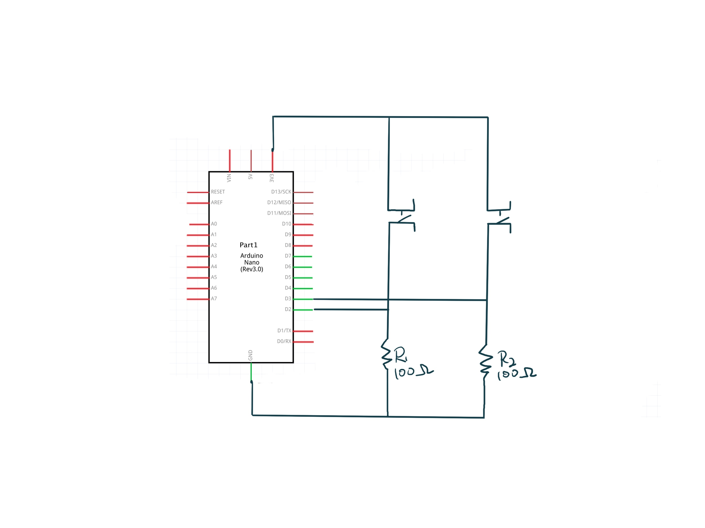

# Final Project Template using Serial

In this week's assignment, I chose to experiment with the first instrument idea from the final project concept. Here, I need to manipulate sound through seven buttons and present the desired visual representation on the screen. After various attempts, I successfully debugged and tested two buttons. When a button is pressed, the screen displays sound waves in different colors at the corresponding position. If a button is held down, the ripples persist, creating a visually perceptible wave effect. When the button is released, the displayed ripples gradually fade. I used white and red colors to differentiate the effects produced by the two buttons.

However, I encountered an issue while debugging the third button; the visual effects did not appear. The code parameters and content are identical to those of the first two buttons, which still function correctly. After checking the website, there were no error reports, but the effects of the encoding for the third button are not displaying.

In my logic, first, I need to input the two buttons I want to use into the code to establish a connection between Arduino and P5.js for usability. Afterward, I need to encode the desired visual effects. Using an "if" statement, I connect these visual effects with the different buttons I've input, ensuring that the intended visual effect appears when a specific button is pressed.

